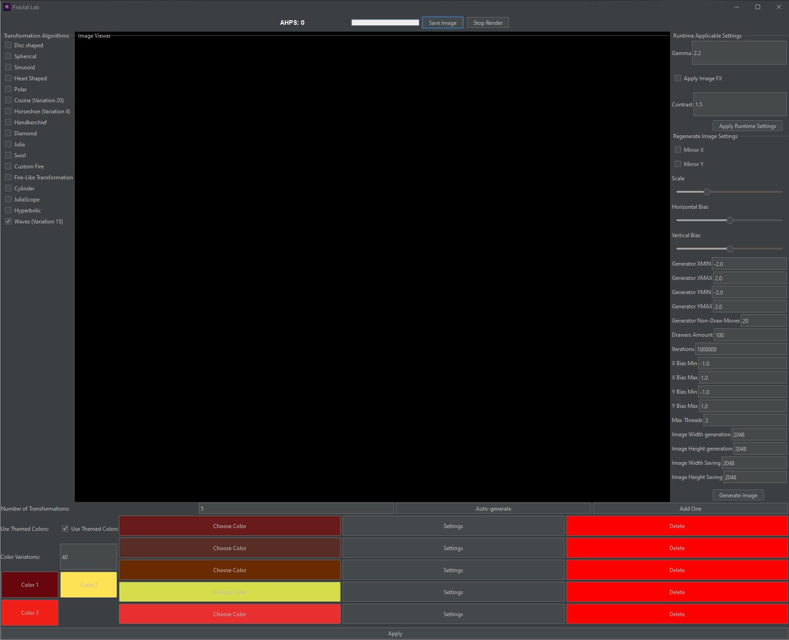

## [👈 Back to readme](../../README.md)

# UI description

## It has 4 main panels:

- **Top panel**
    - **Save image**: To save the image.(It will be saved in resolution that you set in settings **Image Height saving**
      and **Image Width saving**)
    - **Stop Render**: To stop the rendering process.
    - **AHPS label**: To show the average hits per second.
    - **Progress bar**: To show the progress of the current rendering process.

- **Left panel**: It has list of existing algorithms. User can select any algorithm from the list to render the image.
- **Right panel**(Settings panel)
    - **Runtime settings**: This settings can be applied within one rendering process.(to apply them press apply runtime
      settings button)
        - **Gamma**: To adjust the gamma of the image.
        - **Apply image FX**: To apply image effect for now its just contrast setting.
        - **Contrast**: To adjust the contrast of the image.
    - **Regenerate Image Settings** This settings applied using generate button at the bottom
    - **Mirror X**: To apply horizontal symmetry.
    - **Mirror Y**: To apply vertical symmetry.
    - **Scale**: To scale the image.
    - **Horizontal Bias**: To adjust the horizontal bias of the image.
    - **Vertical Bias**: To adjust the vertical bias of the image.
    - **Generator XMIN**: To adjust the minimum value of the x-axis.(Automated by scales)
    - **Generator XMAX**: To adjust the maximum value of the x-axis.(Automated by scales)
    - **Generator YMIN**: To adjust the minimum value of the y-axis.(Automated by scales)
    - **Generator YMAX**: To adjust the maximum value of the y-axis.(Automated by scales)
    - **Generator non-draw moves**: To adjust the number of non-draw moves made by drawers.
    - **Drawers amount**: To adjust the number of drawers.
    - **Iterations**: To adjust the number of iterations made by each drawer.
    - **X Bias Min**: To adjust the minimum value of the x-axis bias.
    - **X Bias Max**: To adjust the maximum value of the x-axis bias.
    - **Y Bias Min**: To adjust the minimum value of the y-axis bias.
    - **Y Bias Max**: To adjust the maximum value of the y-axis bias.
    - **Max Threads**: To adjust the maximum number of threads used in generation.
    - **Image Width generation**: To adjust the width of the image that will be generated.
    - **Image Height generation**: To adjust the height of the image that will be generated.
    - **Image Width saving**: To adjust the width of the image that will be saved.
    - **Image Height saving**: To adjust the height of the image that will be saved.
    - **Generate Image**: Button To generate the image with the current settings.
- **Bottom panel**
    - **Number of transformations**: This sets number of affine transformation that will be automatically generated when
      `Auto-generate` button will be pressed.
    - **Use Themed-colors**: Checkbox to use themed colors.(they are chosen randomly from those that you choose below
      with random bias set by color variance)
    - **Add one**: Button To add one affine transformation to the list of colors.
    - **Auto-generate**: Button To generate affine transformations automatically. This will apply in runtime.
    - **List of affine transformations**: List of affine transformations that will be applied to the image ONLY IF YOU
      PRESS APPLY Button.(You can change colour of each transformation by clicking on the color box, you can set
      individual coefs and you can delete them)

## Here is image of the UI of the application.

